# Acquire-Gov AI Architecture — Diagram Deck

Demo-ready Mermaid diagrams for the **AI capability** layered onto `acquire-gov`
(Phase 1 — AI Adoption). Built from source inventory 2026-06-15; model IDs,
thresholds, collection names, and tool names are verbatim from
`services/ai-orchestrator/app/config.py` and the M1/M2 specs.

**How to use these in the deck:**
- Paste any block into <https://mermaid.live> to export PNG/SVG, **or**
- `npx @mermaid-js/mermaid-cli -i docs/diagrams/ai-architecture.md -o out.png`
  (renders every fenced `mermaid` block).
- Suggested slide order: §1 (context) → §2 (request path) → **§3 (RAG, the
  headline)** → §4 (agentic drafting) → **§4a (section coverage map)** →
  **§5 (batch coordinator DAG — per-Part fan-out + boilerplate)** → §6 (HITL) → §7 (gate
  bands) → **§7a (cost-runaway guard)** → §8 (model tiering map) →
  **§8a (stub mode)** → §9 (audit). §3, §4a, §5, and §7a are the
  "what we added in the redesign" slides.

> **Redesign (2026-06-15):** the wizard moved from "fill 8 sections by hand, AI
> drafts 4" to **"AI drafts everything it safely can; the human reviews."** Now
> **9 of 12 FAR sections auto-populate** (only A, B, J are human-entered), a
> cheap **Haiku** boilerplate path joins the Sonnet drafters, and every agent
> invoke is bounded by an explicit `recursion_limit` (the cost-runaway guard).
> See the §X Changelog at the end for exactly what changed.

---

## 1. System context — where AI sits in the 5-service stack

The AI is **layered on top** of the existing stack, not woven through it. One
new service (`ai-orchestrator`) plus two new data stores (Mongo vector corpus +
AWS Bedrock); everything else is the inherited brownfield baseline.

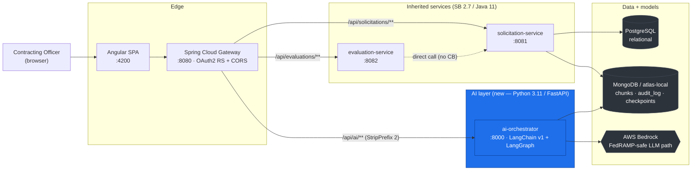

> Talking point: **AWS Bedrock is the sole LLM path** (FedRAMP). Managed
> Bedrock products (Knowledge Bases, Agents, Guardrails) are **hand-built** in
> Phase 1 — that's what the next diagrams show.

---

## 2. Browser → AI request path (the comms layer we just fixed)

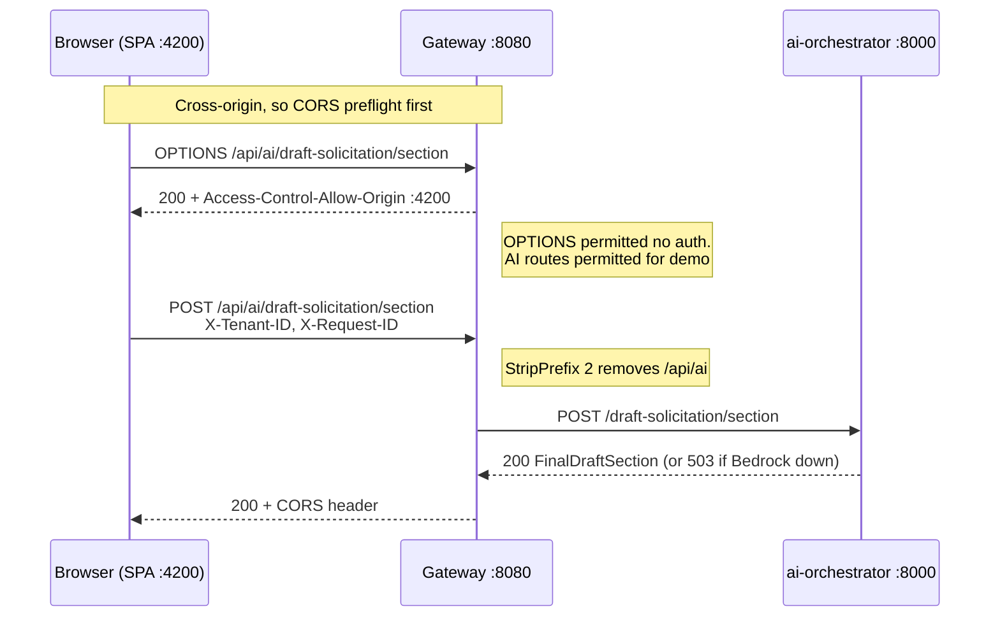

> Three bugs were stacked here: (1) no CORS config, (2) Spring Security 401'd
> the preflight, (3) gateway forwarded `/api/ai/...` verbatim but the orch
> serves at root. All three fixed.

---

## 3. ⭐ RAG retrieval pipeline (M2) — the multi-layer grounding engine

This is the headline AI diagram. Every authoritative answer flows through
**guardrail → tenant isolation → hybrid retrieval → rerank → confidence gate →
citation → audit**. No layer is skippable.

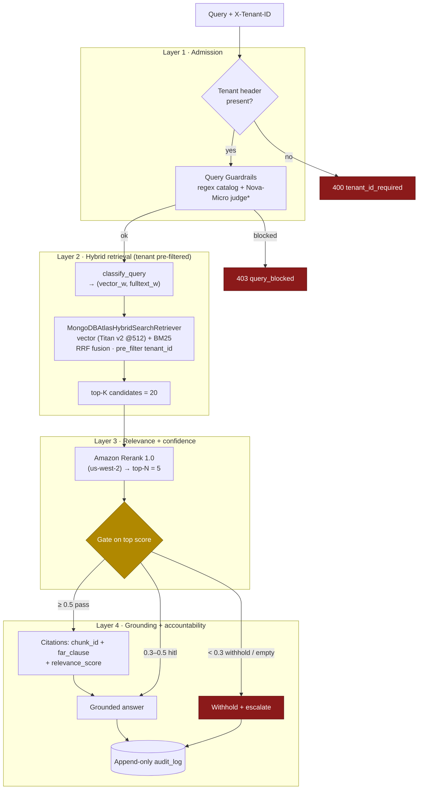

> \*Nova-Micro LLM judge is stubbed `on_topic` in Phase 1 (regex-only
> enforcement live); wired in Phase 1.5.
>
> **Query classification (ADR-0006 D3)** biases the fusion:
> clause-number or known acronym → `(0.5, 2.0)` (favor lexical/BM25);
> semantic phrase >8 words → `(1.5, 0.7)` (favor vector); default `(1.0, 1.0)`.

---

## 4. ⭐ Agentic drafting (M1) — Section Drafter tool sequence

The drafter is a LangChain `create_agent` harness. Tools fire in a fixed
sequence; **the gate runs before any Sonnet spend**, and citations are
hard-validated after drafting (unknown chunk_id → hard fail). Every invoke is
now bounded by `recursion_limit = DRAFTER_RECURSION_LIMIT (12)` — see §7a.

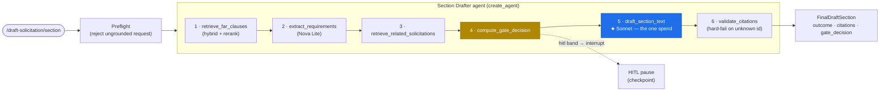

> Retrieved FAR text is wrapped in
> `<retrieved_context trust_level="reference_only">` tags — **data, not
> instructions** (prompt-injection defense, ADR-0011 D1.2). Response is forced
> to the `FinalDraftSection` schema via `ToolStrategy` structured output.

---

## 4a. ⭐ Section coverage map (redesign) — who drafts each FAR section

Of the 12 UCF sections, **9 now auto-populate** from one button. Only **A, B, J**
need human entry. Three generation mechanisms, tiered by cost: Sonnet *agents*
(full retrieve→gate→draft loop), a cheap **Haiku** single `with_structured_output()`
call for boilerplate (no agent, no tools, no loop), and deterministic resolution.

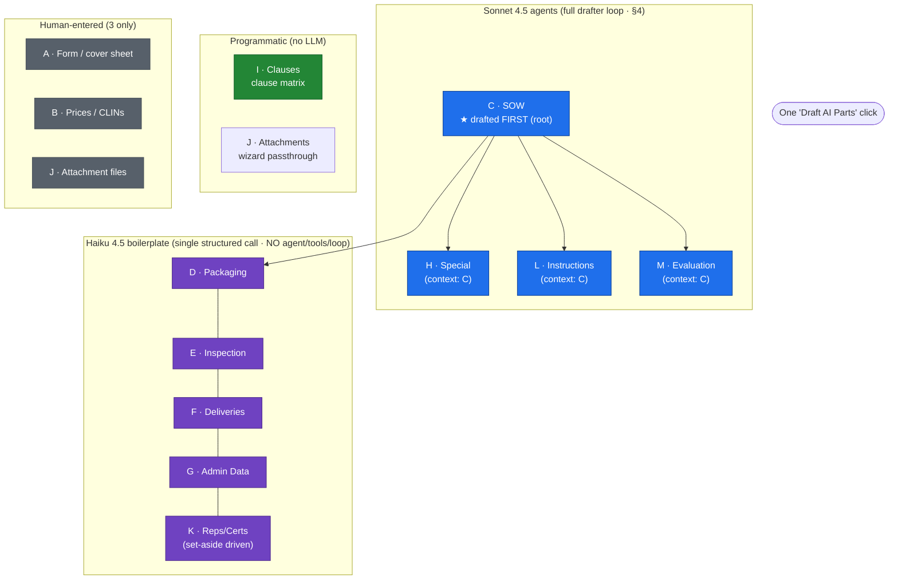

> **C is the root.** It is drafted first; H, L, M, and the D-G/K boilerplate all
> receive the drafted SOW as context (FAR requires L/M written against C). The
> Haiku boilerplate sections (D-G + K) are **near-verbatim FAR/GSAR clause text**
> — a single bundled structured-output call, not free generation, so it cannot
> recurse. K is set-aside-driven incorporation-by-reference (52.204-8 + the
> set-aside notice clause), reusing the Part II clause-matrix pattern.

---

## 5. Batch coordinator (M1) — LangGraph DAG (per-Part fan-out + boilerplate)

A custom `StateGraph` fans out the two Sonnet Part drafters, the new Haiku
boilerplate generator, the programmatic Part II resolver, and the Part III
passthrough as **parallel siblings** — all feeding `aggregate → critic → END`.
The boilerplate sections (D-G/K) are merged into the Part I / Part IV results at
aggregate time.

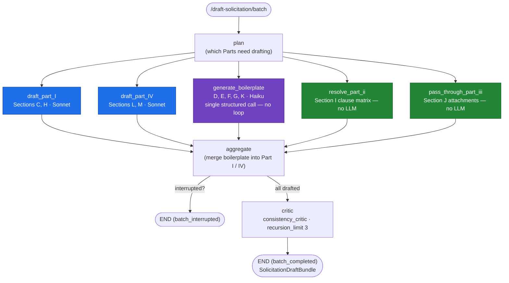

> **Five siblings off `plan`.** `draft_part_I` drafts C+H in one agent call (so H
> is written against C); `draft_part_IV` drafts L+M together (L↔M aligned by
> construction). `generate_boilerplate` is a single Haiku call (D-G/K). Part II
> is a deterministic hash-pinned FAR clause lookup; Part III is wizard
> pass-through. The Sonnet drafter fan-out stays capped at
> `MAX_BATCH_FAN_OUT = 2`; the boilerplate node is one Haiku call so it does not
> consume the fan-out budget. Every Sonnet invoke carries `recursion_limit = 12`,
> the critic `recursion_limit = 3` (§7a).
>
> **Planned refinement (live-path, not yet wired): C-first sequencing.** Today
> Part IV drafts L/M from its own retrieval — it does not see the drafted SOW.
> FAR best practice is L/M written against C, so the target is to draft C first
> and feed it as context into Part IV (and into H/boilerplate). The consistency
> critic flags C↔L/M misalignment warn-only in the interim. Deferred because it
> restructures the `Send` fan-out and the HITL interrupt/resume handshake
> (DEMO-REDESIGN-spec §8).

---

## 6. HITL gate + durable checkpoint (authority over accuracy)

Low-confidence drafts **pause for a Contracting Officer** instead of guessing.
The pause survives multi-day delays and process restarts (MongoDB checkpointer,
no TTL).

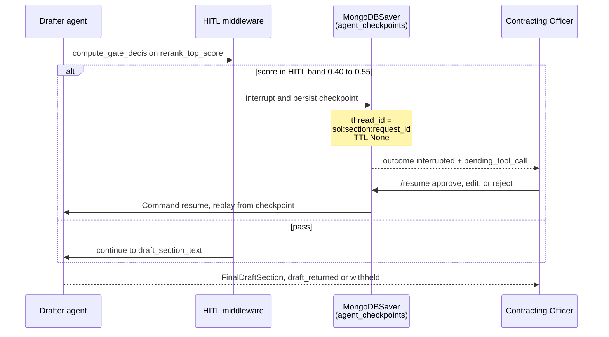

> **Authority over accuracy:** the gate exists for accountability, not model
> quality — model confidence never downgrades a hard gate. Orphaned paused runs
> are swept after `AGENT_ORPHAN_AGE_DAYS = 30`.

---

## 7. Confidence gate — the three bands

Two gate surfaces share one threshold contract: the M2 retrieval gate (on
rerank score) and the M1 agent gate tool (drives the HITL interrupt).

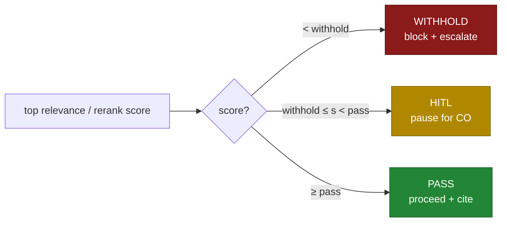

| Surface | Withhold | HITL band | Pass | Source |
|---|---|---|---|---|
| M2 retrieval gate (rerank score) | `< 0.30` | `0.30 – 0.50` | `≥ 0.50` | `RERANK_WITHHOLD/HITL_THRESHOLD` |
| M1 agent gate tool | `< 0.40` | `0.40 – 0.55` | `≥ 0.55` | `GATE_WITHHOLD/PASS_THRESHOLD` |

---

## 7a. ⭐ Cost-runaway guard (redesign) — bounded loops + token caps

**Context:** the 2026-06-12 incident — one unbounded critic run burned **2.8M
tokens**. The critic was capped afterward, but the expensive Sonnet drafters
still ran at langgraph's bound default `recursion_limit: 9999`. The redesign
bounds **every** agent invoke explicitly and caps `max_tokens` per model, and the
Haiku boilerplate path has **no loop surface at all**.

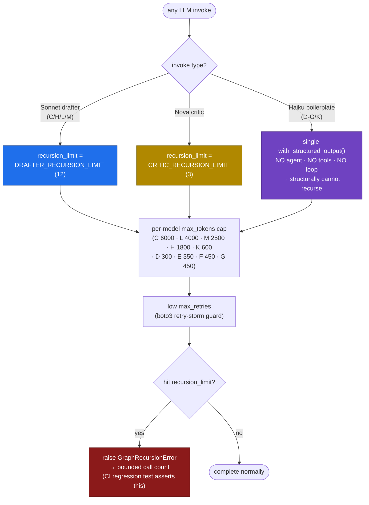

> The old default `9999` meant a misbehaving agent could loop ~9999 times before
> stopping — the failure mode behind the 2.8M-token incident. **Regression test:**
> a mock agent that always re-emits a tool call must die at the cap with a
> bounded call count, asserted in CI — the guard that would have caught the
> original incident.

---

## 8. Bedrock model tiering — which model does what (and how expensive)

Models are picked by a **cost tier**: the expensive Sonnet drafters do the
authoritative section/part text (C/H/L/M); the cheap Haiku tier does boilerplate
(D-G/K); Nova Lite handles extraction and the consistency critic; Titan v2 does
embeddings; Amazon Rerank scores relevance.

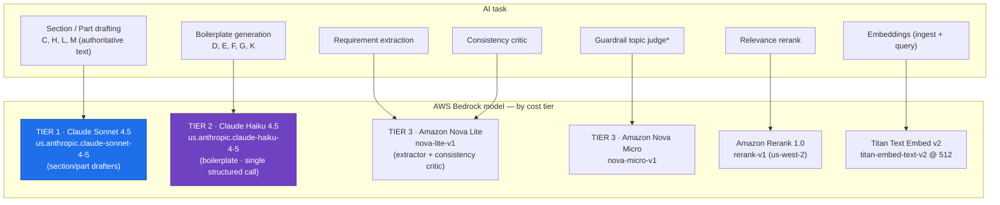

> Cost discipline: the **expensive model (Sonnet) is called once per draft**,
> after the gate passes, and only for the four judgment-heavy sections. The new
> **Haiku tier** covers the five near-verbatim-clause boilerplate sections in a
> single bundled structured call. Extraction, critic, and topic-judge use cheap
> Nova tiers. Rerank is region-pinned to us-west-2 (only region with Rerank 1.0).

---

## 8a. Stub mode (redesign) — zero-Bedrock demo path

`AI_STUB_MODE` short-circuits **all** generation to canned, realistic content
(zero Bedrock spend). It exists so demo-day works while the Bedrock key is being
rolled — the full DAG, gates, provenance, and review UI all run; only the model
calls are replaced by deterministic stub returns.

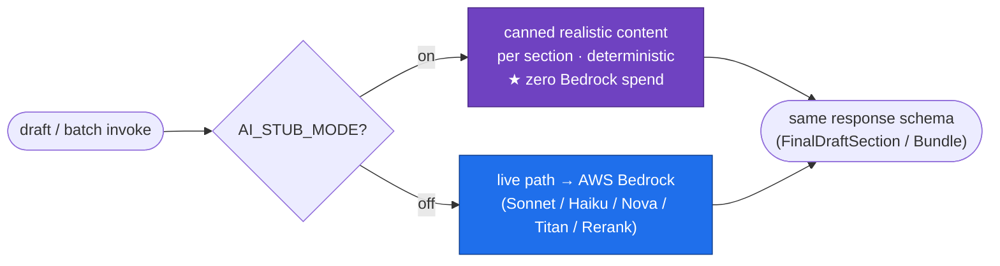

> The stub returns the **same response schema** as the live path, so the whole
> generate-and-review flow is exercisable before the key lands. The demo input
> script (`docs/specs/m1-agentic-drafting/DEMO-SCRIPT.md`) is kept distinct from
> the stub returns so codebase-readers don't dismiss the demo as "all stubbed."

---

## 9. Auditable by default — the append-only record

Every AI-assisted decision writes one OIG-replayable row before the response
returns (synchronous write-through, writer role has no UPDATE/DELETE).

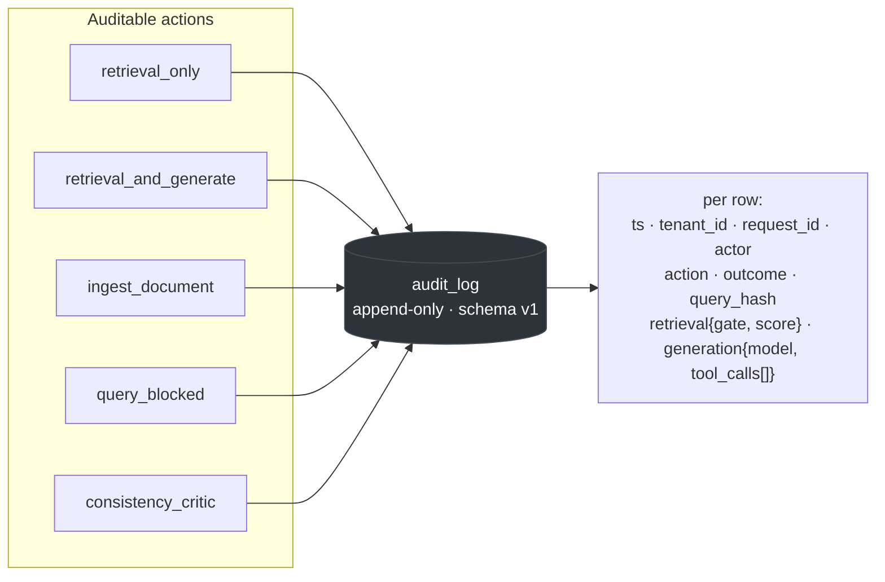

> Raw queries are **never stored** — only SHA-256 hashes. The
> `generation.tool_calls[]` sub-record captures every agent tool invocation for
> replay.

---

## 10. Data stores at a glance

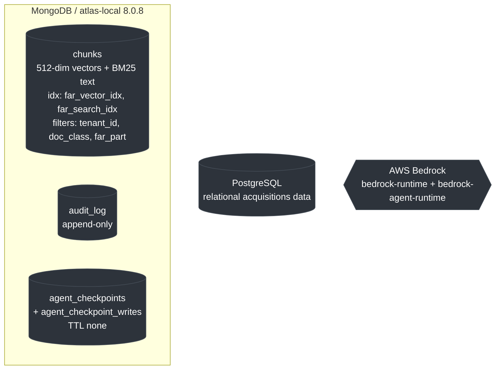

---

### Appendix — exact values (for Q&A)

| Parameter | Value |
|---|---|
| Embedding | Titan v2, **512** dims, cosine |
| Retrieve candidates → rerank top-N | **20 → 5** |
| Chunking | size **1200**, overlap **150** |
| Rerank thresholds (withhold/pass) | **0.30 / 0.50** |
| Agent gate thresholds (withhold/pass) | **0.40 / 0.55** |
| Rate limit (per tenant) | **30/min**, **1000/day** |
| Batch fan-out cap | **2** |
| Drafter recursion cap (Sonnet) | **12** (`DRAFTER_RECURSION_LIMIT`) |
| Critic recursion cap | **3** (`CRITIC_RECURSION_LIMIT`, Nova-Lite loop guard) |
| Sections auto-populated / human-entered | **9** (C,D,E,F,G,H,I,K,L,M) / **3** (A,B,J) |
| max_tokens per section | C 6000 · L 4000 · M 2500 · H 1800 · K 600 · D 300 · E 350 · F 450 · G 450 |
| Checkpoint TTL / orphan sweep | none / **30 days** |
| Upload cap | **10 MB** |
| Stub mode flag | `AI_STUB_MODE` (zero-Bedrock canned content) |

---

## X. Changelog (2026-06-15 redesign)

Generate-and-review redesign per `docs/specs/m1-agentic-drafting/DEMO-REDESIGN-spec.md`.
What changed in this deck so the slide author knows what's new:

**New diagrams (added):**
- **§4a Section coverage map** — who drafts each of the 12 FAR sections; shows
  the 9 auto-populated sections across the three tiers (Sonnet agents, Haiku
  boilerplate, programmatic) and the 3 human-entered (A, B, J).
- **§7a Cost-runaway guard** — explicit `recursion_limit` per invoke
  (DRAFTER=12, CRITIC=3), per-model `max_tokens` caps, low `max_retries`, and
  the CI loop-cap regression test. Frames the 2026-06-12 2.8M-token incident.
- **§8a Stub mode** — `AI_STUB_MODE` zero-Bedrock canned-content path for
  demo-day before the key lands.

**Changed diagrams:**
- **§5 Batch coordinator DAG** — added the **new `generate_boilerplate` (D-G/K,
  Haiku) node** as a fifth parallel sibling off `plan` (alongside the two Sonnet
  Part drafters and the two programmatic nodes); boilerplate merged at aggregate;
  critic annotated with `recursion_limit 3`. C-first sequencing is documented as
  a planned live-path refinement (NOT yet wired — see the §5 note).
- **§8 Model map → "Model tiering"** — added the **Haiku 4.5** boilerplate tier;
  reorganized into explicit cost tiers (Sonnet drafters / Haiku boilerplate /
  Nova extractor+critic / Titan embeddings / Rerank).
- **§4 Agentic drafting** — annotated the drafter agent with its new
  `recursion_limit = DRAFTER_RECURSION_LIMIT (12)` bound.
- **Header** — updated suggested slide order to include §4a, §7a, §8a and the
  rebuilt §5; added a redesign summary callout.
- **Appendix** — added drafter recursion cap, section coverage count, per-section
  `max_tokens` table, and the stub-mode flag.

**Unchanged (preserved):** §1 context, §2 request path, §3 RAG 4-layer pipeline
(the headline), §4 drafter tool sequence (annotation only), §6 HITL, §7 gate
bands, §9 audit, §10 data stores.

> Not yet rendered to PNG/SVG — no `mmdc` in this environment. Re-render with the
> commands at the top of this file (`npx @mermaid-js/mermaid-cli ...` or
> mermaid.live) before dropping into the slide deck.
